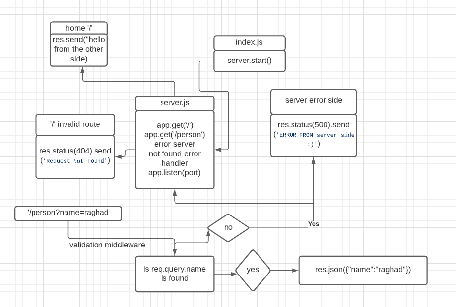

# basic-express-server

## links:

[heroku link](https://raghad-app.herokuapp.com/)

## setup environment

### Install

initialization using npm inint -y  
install libraries like express dotenv   
install devDependencies like jest supertest  
create files tree  

 

### Test

404 on a bad route  
404 on a bad method  
500 if no name in the query string  
200 if the name is in the query string  
given an name in the query string, the output object is correct  

 

 ## UML Diagram

 